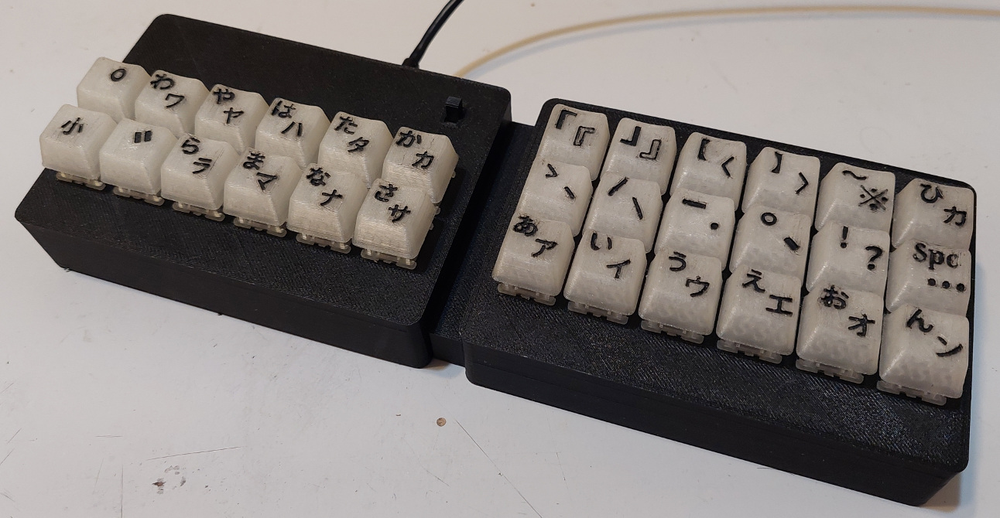
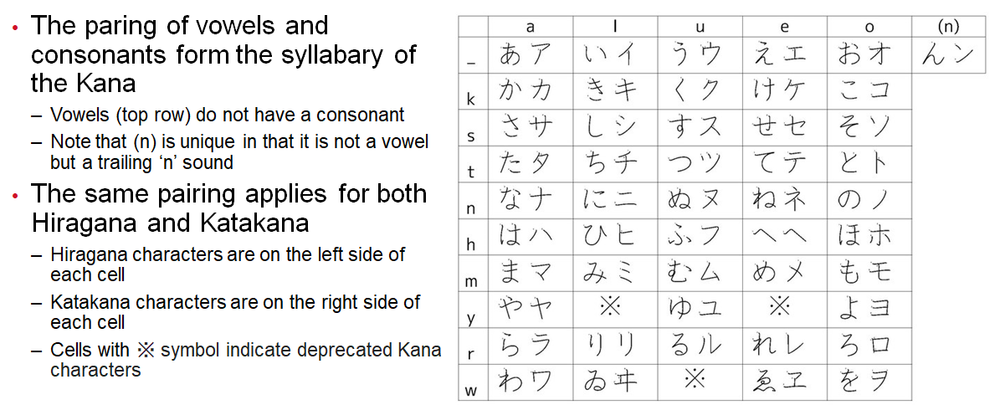
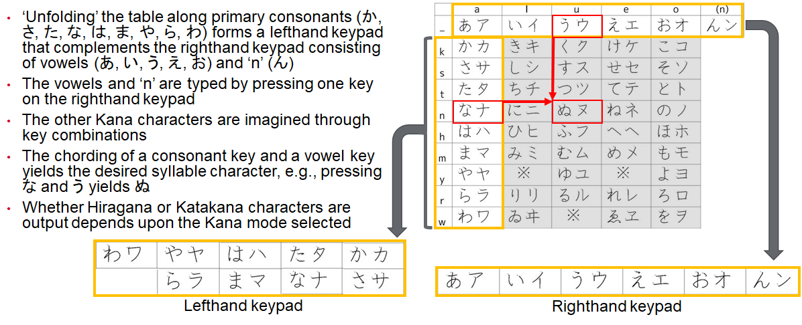
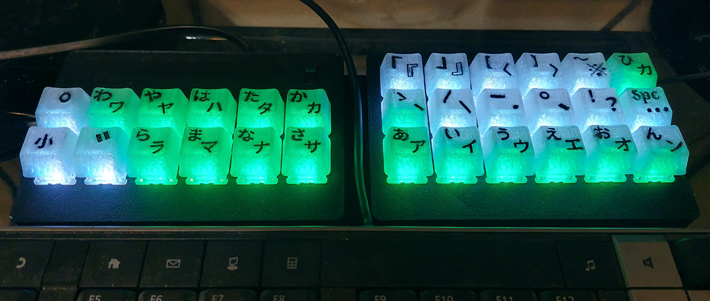
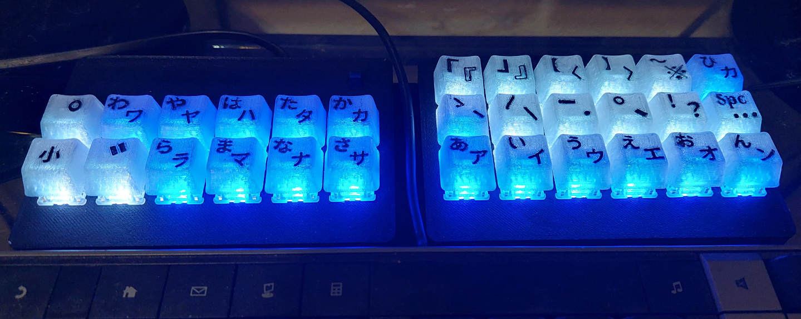
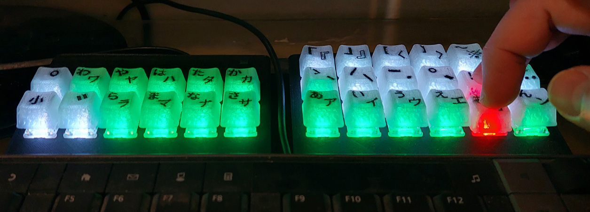
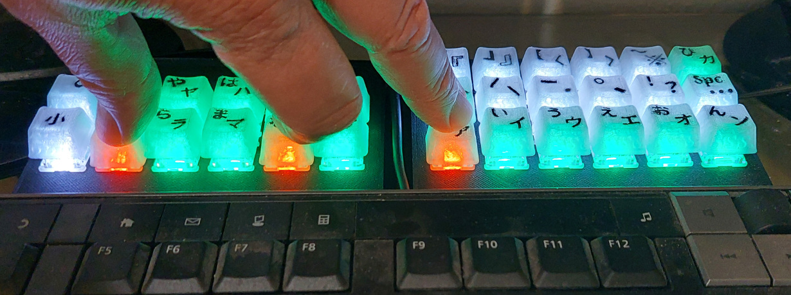

# KanaChord Keyboard (カナコード・キーボード)
## Overview
KanaChord is an auxiliary keyboard that works in parallel with a standard English keyboard and generates Unicode keyboard macros to render Japanese Kana characters.  This allows the user to immediately start typing in the Japanese Kana, rather that installing special software and switching language input modes on a single keyboard.  KanaChord Keyboard can assist the Japanese learner by providing a means to improve their skills by writing in Japanese, in addition to reading and speaking.  Note that during the composing of this README, KanaChord Keyboard was used to type the Kana characters displayed.

The Japanese writing system consists of three components: Kanji, Hiragana, and Katakana. Kanji consists of Chinese logography and conveys main ideas and names in sentences, e.g., 私, 東京, 何 (‘I’, ‘Tokyo’, ‘what’).  There are thousands of unique Kanji characters.  Hiragana consists of 48 syllabic characters that are used for some words of Japanese origin and grammatical sentence fragments, e.g., あなた, これ, の (‘you’, ‘this’, possessive particle).  Katakana also consists of 48 syllabic characters that are used for foreign loan words and names, e.g., テーブル, クッキー, マック (‘table’, ‘cookie’, ‘Mac’).  The table below shows the syllabary of Hiragana and Katakana, known collectively as the Kana.

The layout of the Kana Table inspires a chording keyboard input method. Chording is where multiple keys are pressed simultaneously on the keyboard to obtain a desired character output.  The illustration below provides further explanation and demonstration of how chording is used on the KanaChord Keyboard.

## Features
KanaChord includes dynamic key coloring that provides indication of character type, Kana mode, and error feedback.  The three Shift keys on the left keypad are normally white:
- Voicing mark, a.k.a. dakuten or ten-ten (ﾞ),
- Plosive mark, a.k.a. handakuten or maru (ﾟ),
- Small characters, a.k.a. chiisai (小), also used to ‘shift’ to alternate punctuation and special characters.

Punctuation keys on the top two rows of the right keypad are also normally white:
- Vertical iteration mark (〳,〴,〵), continuation mark (ー), and separation (・) characters ,
- Sentence pausing (、) and ending characters (。, ! , ?),
- Wide space and ellipsis (…) characters,
- Commonly-used quotation (「, 」,『, 』), bracket (【, 】,〈, 〉), and special (〜,※) characters.

The Kana and horizontal iteration mark (ゝ,ゞ,ヽ,ヾ) keys are green for Hiragana mode or blue for Katakana mode, as selected by the mode key (ひカ) at upper right-hand corner of the right keypad.

Feedback is provided to the user for incorrect key combinations by changing those keys red.  Releasing the keys will cause the keys to revert to their original colors.  Some examples are provded below:

Keyboard error lighting with press of ! and お key combination.

Keyboard error lighting with press of ﾞ, な, and あ key combination.

A slide switch above the か key provides three user-selectable Unicode key sequences to support different computer platforms:
- Four-characer hexidecimal Unicode value, followed by Alt-X: Supports Microsoft Word and Wordpad, and LibreOffice Writer.
- Ctrl-Shift-u, followed by four-character hexidecimal Unicode value: Supports Linux applications like LibreOffice Writer and Firefox.
- Option key, followed by four-character hexidecimal Unicode value: Support MacOS applications (not yet tested).

## Implementation Overview
The primary electical componets of the KanaChord Keyboard are a Raspberry Pi Pico (RP2040) microcontroller, an Adfruit NeoKey 5x6 Ortho Snap-Apart keyboard PCB, and thirty Cherry MX mechanical key switches.  The keycaps and keyboard enclosure are 3D printed designs created with TinkerCAD.  Blank keycaps and an OpenSCAD tight-fit box generator were found on Thingiverse.  No special hardware, such as screws are needed to mount the electrical components and assemble the enclosure.  Details on the electronics, enclosure, and their assembly can be found in the hardware subdirectory.

Kanachord's software was developed with the Arduino IDE (version 1.8.19) and Earle Philhower's RP2040 board support package.  The USB Keyboard library, Adafruit Neopixel library, and Mark Stanley's Key and Keypad libraries provided critical software functions.  Details on the software can be found in the software subdirectory.

## Hardware and Software Licenses

KanaChord's circuit design and the STL files for the keycaps, component mounting parts, and enclosure parts are placed under Creative Commons Attribution-NonCommercial-NoDerivatives license.

KanaChord's source code that I wrote (KanaChord.ino, kana.h, kbd_mgt.cpp, and kbd_mgt.h) are placed under GNU General Public License, Version 3.0.

The slightly-modified versions of Mark Stanley's Key and Keypad libraries (Key2040.cpp, Key2040.h, Keypad2040.cpp, and Keypad2040.h) fall under the license of the original sources.

## Feedback is Welcome!
My goal is to provide an axuilary keyboard that is useful to those who want to start writing in Japanese, while learning Japanese.  I hope to have provided operational features, keycaps, and Asian special characters that would most likely be used.  If you have recommendations for additional features, alternate keycaps, or Asian special characters, please let me know.  I will accomodate as many recommendations as feasible.

## The Future of KanaChord Keyboard
As, mentioned above, KanaChord Keyboard outputs only Kana Unicode, not Kanji Unicode.  This is an obviously glaring omission for writing in Japanese.  A software IME (Imput Method Editor) that accepts Kana Unicode input could be used to make up for this shortcoming.  This takes away from the goal of not needing to install special software.

To that end, I have been developing the next version of this keyboard, which also outputs Kanji Unicode. I call it KanaChord Plus Keyboard (カナコード・プラス・キーボード). It is approaching the end stages of development and I hope to release it soon.  I can say that it will output Unicodes for over 6,000 of the most commonly used Kanji. The user will be able to select from them, as they type the appropriate onyomi (Chinese), kunyomi (Japanese), or nanori (name) readings using the Kana. This will help the user learn Kanji, as they learn the proper readings and pronunciations from the Kana typed.
