# KanaChord Hardware

## Electronics Components
KanaChord Keyboard uses following electronics parts:
- 1 x Raspberry Pi Pico microcontroller
- 1 x [Adfruit](https://www.adafruit.com) [NeoKey 5x6 Ortho Snap-Apart Mechanical Key Switches w/ NeoPixel - For MX Compatible Switches](https://www.adafruit.com/product/5157)
- 30 x Cherry MX RGB frame-mount mechanical key switches, e.g., [Cherry MX Brown Switches](https://www.cherrymx.de/en/cherry-mx/mx-original/mx-brown.html) (does not count spares)
- 1 x BC547 (or equivalent) NPN transistor
- 1 x 2.2 Kohm 1/8 Watt resistor
- 1 x 6.8 Kohm 1/8 Watt resistor
- 1 x Three-position (NC-NO-NC) slide switch (E-Switch Slide Switches 500SSP3S2M1QEB, Mouser 612-500SSP3S2M1QEB)
- 27 x 0.1" Spacing Row Right Angle Headers (does not count spairs), e.g., [Schmartboard brand](https://schmartboard.com/qty-10-0-1-spacing-40-single-row-right-angle-headers-920-0076-01/)
- 2 x Seven-position ITT connector shell - (e.g., Adafruit [Large Single Row Housing Pack](https://www.adafruit.com/product/3146))
- 3 x Five-position ITT connector shell - (e.g., Adafruit [Small Single Row Wire Housing Pack](https://www.adafruit.com/product/3145))
- 1 x Four-position ITT connector shell - (e.g., Adafruit [Small Single Row Wire Housing Pack](https://www.adafruit.com/product/3145))
- 1 x Three-position ITT connector shell - (e.g., Adafruit [Small Single Row Wire Housing Pack](https://www.adafruit.com/product/3145))
- 27 x Female crimp contact pins (does not count spares)
- 5 x Male crimp contact pins (does not count spares)
- 1 x 12 inches of Forty-conductor ribbon cable 
- 1 x USB A to USB Micro B cable
- Heat-shrink tubing for enclosing the unidirectional level shifter

## Keyboard Schematics
Below is a pictorial schematic of the keypad portion of the KanaChord keyboard.

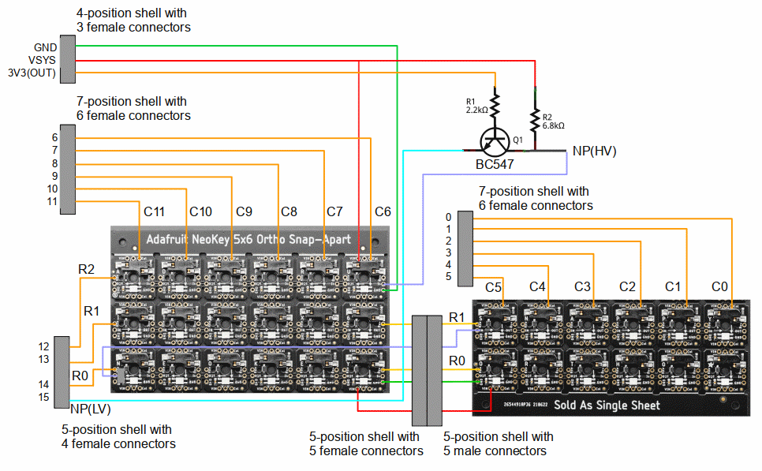

While the Neopixels of the Ortho Snap-Apart board can opperate at 3.3 Volts, the 3.3-Volt regulator on the Pico cannot supply enough current.  Therefore, the Neopixels are powered by the Pico's 5-Volt VSYS output.  Consequently, a unidirectional level shifter is used to convert the low-voltage Neopixel signal, NP(LV), to a high-voltage Neopixel signal, NP(HV).  The BC547 and resistors are used to implement the unidirectional level shifter circuit.

Below is a pictorial schematic of the Raspberry Pi Pico portion of the KanaChord keyboard.

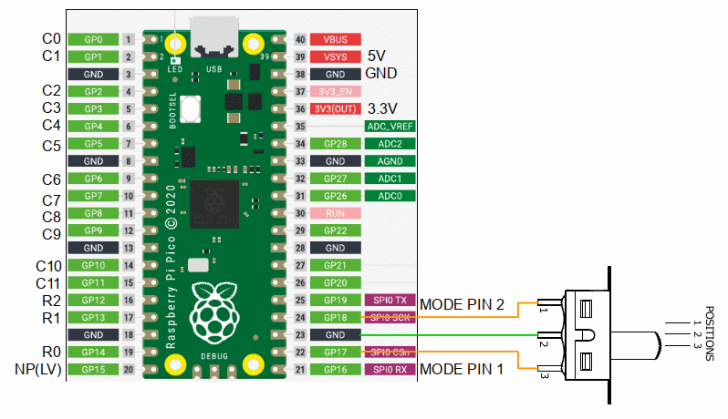

The right-angle header pins are soldered in 'gull-wing' fashion to pins 1 through 20, 22 through 24, and 36 through 39 of the Pico.  Note that the slide switch is not soldered directly to the Pico.  Instructions found in the Electrical Assembly will describe the wiring harness that is used.

## Electrical Assembly 
### Keypad Preparation 
Before assembly, the snap-apart keyboard must be broken into two pieces to form two PCBs (Printed Circuit Boards) for the left and right keypad assemblies.  As shown in the pictoral schematic above and the pictures below, cut apart the keyboard so that the bottom two rows form the left keypad and the top three rows form the right keypad.  Rather than actually bending the PCB to snap it, it is recommended to use a thin saw to cut the bridges between the rows.  DO NOT cut off the blank sections on the top and bottom of the PCB, as the mounting holes will be used to help position the keypads in the keyboard enclosure.

### Left Keypad Wiring 
The wiring of the left keypad assembly is shown in the picture below.  Take note the direction and length of the wires that extend from the left-hand keypad PCB.

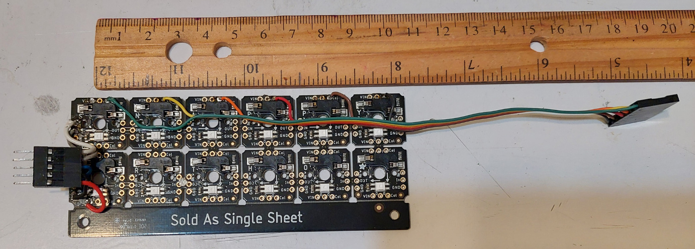

First, cut a six-conductor section of ribbon cable with a length of approximatly 19 cm (7.5 inches).  This will be the column cable for the left keypad.  Separate out the individual conductors for about 3 cm (one inch), attach six (6) female crimp terminals, and insert the terminals into a seven (7) terminal connector shell.  Note that there will be an unused place between the terminal pins for Columns 1 and 2, which is Ground Pin 3 on the Pico. Then, as shown in the picture, start at the left end of of the keypad PCB and solder a conductor to a column solder pad. Work towards the right end of the keypad, shortening the length of the conductor to match to the column solder pad location, while keeping the ribbon cable parallel to the PCB. Note that during installation, this cable will fold over to attach to Pins 1 through 7 on the Pico.

Next, create the male keypad interconnect harness using five (5) male crimp terminals. This is a short cable, with a length of approximately 3 cm (1.25 inches), it is recommended to use separate wires, rather than a ribbon cable. A five (5) terminal connector shell is used for this harness. Use the pictorial schematic above for wiring directions. This completes the wiring of the left keypad assembly.

### Right Keypad Wiring 
The wiring of the right keypad assembly is shown in the picture below. Again, take note of the direction and length of the wires that extend from the right-hand keypad PCB.

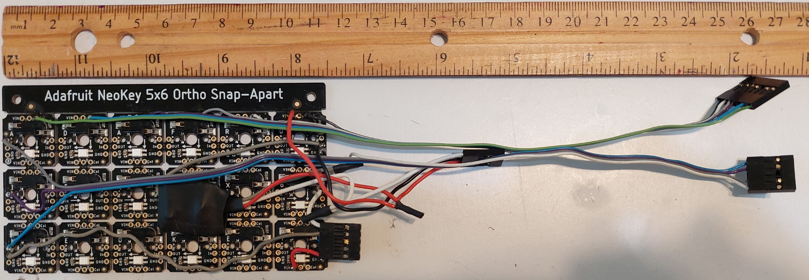

First, cut a six-conductor section of ribbon cable with a length of approximatly 26 cm (10.25 inches).  This will be the column cable for the right keypad.  Separate out the individual conductors for about 3cm (1.25 inches), attach six (6) female crimp terminals, and insert the terminals into a seven (7) terminal connector shell.  Note that there will be an unused place between the terminal pins for Columns 9 and 10, which is Ground Pin 13 on the Pico. Then, as shown in the picture, start at the left end of of the keypad PCB and solder a conductor to a column solder pad. Work towards the right end of the keypad, shortening the length of the conductor to match to the column solder pad location, while keeping the ribbon cable parallel to the PCB. Note that during installation, this cable will fold over to attach to Pins 9 through 15 on the Pico.

Next, create the female keypad interconnect harness using five (5) female crimp terminals. This is a short cable, with a length of approximately 3 cm (1.25 inches), it is recommended to use separate wires, rather than a ribbon cable. A five (5) terminal connector shell is used for this harness. Use the pictorial schematic above for wiring directions.

Now, cut a four-conductor section of ribbon cable with a length of approximatly 28 cm (11 inches).  This will be the row cable for the right keypad.  Separate out the individual conductors for about 3 cm (1.25 inches), attach four (4) female crimp terminals, and insert the terminals into a five (5) terminal connector shell.  Note that there will be an unused place between the terminal pins for Rows 0 and 1, which is Ground Pin 18 on the Pico. Note that three of the ribbon cable conductors attach to the Row solder pads on the right keyboard PCB, while one conductor attaches to the signal input of the level shifter circuit. Note that during installation, this cable will fold over to attach to Pins 16 through 20 on the Pico.

Assmble the unidirectional level shifter circuit on a small piece of prototyping board with solder pads or as otherwise desired.  The idea is to keep the resulting assembly small and relatively flat.  In the implementation shown in the picture, judicious application of heat-shrink tubing was performed to prevent short circuits. ***Note: Instructions for constructing of an equivalent, free-form-wired level shifter can be found on the [KanaChord Plus Hardware page.](https://github.com/maccody/KanaChordPlus/tree/main/hardware#level-shifter-assembly)***  The circuit is wired into the power harness, which is approximately 10 cm (3.5 inches) long.  The power harness has three (3) female crimp connectors that are inserted into a four (4) terminal connector shell.  Note that there will be an unused place between the Ground and 3V3(OUT) pins, which is the 3.3V_EN pin 37 on the Pico.  Consult the pictorial schematic above for the wiring of the level shifter circiut, with the output of the level shifter connected to the Neopixel input and the power harness 5V and Ground to the right keyboard PCB. During installation, the power harness connector will attach to Pins 36 through 39 on the Pico. This completes the wiring of the right keypad assembly.

The macro mode slide switch is soldered to a three-wire harness that is 5 cm (2 inches) long.  The harness has three (3) female connector pins crimped on and placed within a three-position connector shell. Consult the pictorial schematic above for the wiring of the switch harness. During final assembly, the connector will be placed on the header pins at positions 22 through 24.

## 3D-Printed Keycaps
The keycaps for the KanaChord Keyboard were created in TinkerCAD, as shown in the illustration below.  The STL files for the left-hand and right-hand keycap sets can be viewed with the Github STL viewer by clicking on the STL files listed above.

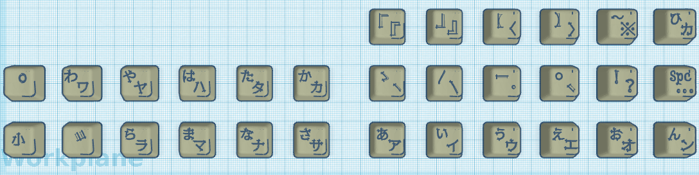

The blank keycap from makerhack's (Chris Garrett) [Custom Cherry MX Keycaps](https://www.thingiverse.com/thing:4702109) was used as the source keycap.  The design is licensed under the [Creative Commons - Attribution license](https://creativecommons.org/licenses/by/4.0/). The Kana and special charaters are text objects converted to TinkerCAD 'holes' that are combined with blank keycaps to form insets. The keycaps were sliced with Cura using the Standard Quality (0.2mm) setting, with 20% infill using the gyroid infill pattern, and Tree supports were used. The keycaps were printed with untinted PLA to allow light from the Neopixels to shine through. After printing, the insets were filled with black acrylic paint, followed by a coat of flat, clear enamel paint.

## 3D-Printed Enclosure
The enclosure for the KanaChord Keyboard was also created in TinkerCAD, as shown in the illustrations below.  The STL files for the individual components of the enclosure can be viewed with the Github STL viewer by clicking on the STL files listed above.  **NOTE: The STL files for the case, base, and foot parts have been updated since the images below were generated.  The assembly process is still the same.**

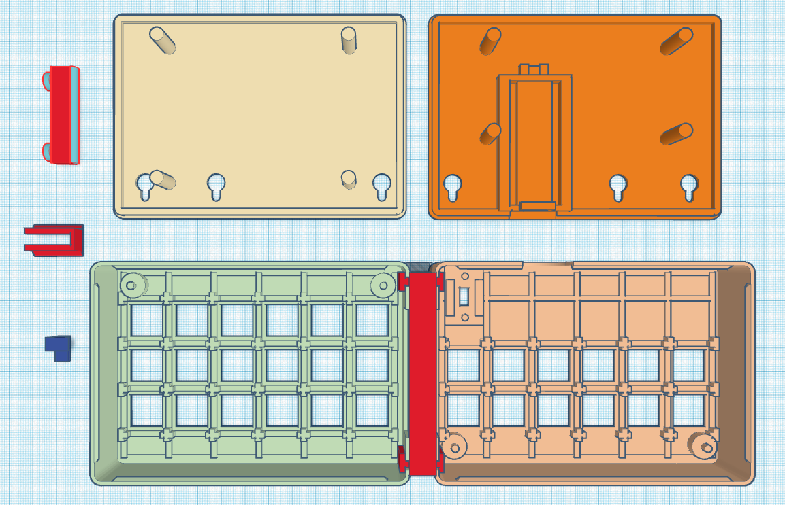

The left and right keycase enclosures were created using 0707070user's OpenSCAD program [Customizable snap-fit electronics project box enclosure](https://www.thingiverse.com/thing:2866563). It is licensed under the [Creative Commons - Attribution license](https://creativecommons.org/licenses/by/4.0/). The enclosure components are flipped so tha the lids now act as baseplates for the keyboard enclosure. The enclosures were edited to create the key switch holes of the integral keyplates, the switch and Pico mounts, and pass-through holes for the keyboard feet, and the USB cable.  

The enclosure was designed in halves to fit on the build plate of a Crealty Ender 3 Pro 3D printer.  All components were sliced with Cura using the Low Quality (0.28mm), with 20% infill using the standard in-fill pattern, and no supports were used.  The case components were prited in black PLA, although any color can be used, if desired.

## Mechanical Assembly

### Applying PCB Cushions
The keypad PCBs are connected to the key switches via sockets.  To prevent the PCBs from coming loose from the key switches, supports are provided to keep the PCBs in place. Two of these supports are shown in the photo below.

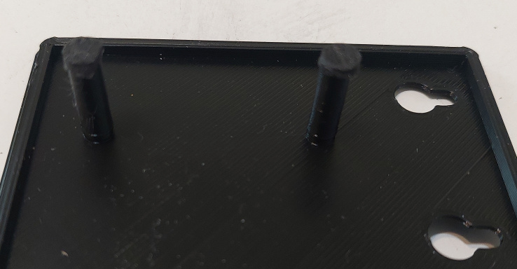

The height of each support is such that there is about a 2mm (0.1 inch) gap from the top of the supports to the underside of the PCBs. To fill in the gap, a small disc of 2mm-thick craft foam is attached to top of each support with double-sided adhesive tape.  One way to make the discs is to apply a strip of double-sided tape to a piece of craft foam.  A single-hole hole punch is used to create the discs with the adhesive tape also cut to the same size as the disc.  Eight (8) discs will be needed for the supports.

### Mounting the Raspberry Pi Pico
The Pico is mounted to the left keyboard base by first inserting the end with the USB connector under the bridge of the processor mount at the edge of the keyboard base. Once this is done, push the opposite end of the Pico down into the depression of the processor mount. Finally, slide the retaining clip into the notches in front of the processor mount until the tab of the retaining clip is securely on top of the end of the Pico.

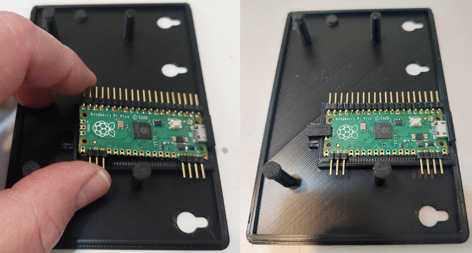

### Mounting the Macro Mode Switch
The Macro Mode slide switch is placed into the left keyboard enclosure such that the switch handle passes through the hole in the enclosure and the tabs on each end of the switch sit around the two retaining pegs.  Once in place, the switch clip is slid into place around the switch.  Make a note of the order of the wires on the switch and connector, so that the connector is properly connected to the Pico later.

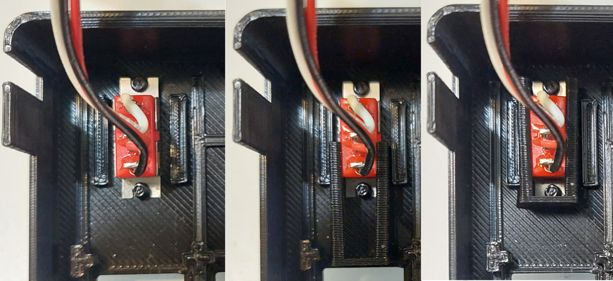

### Break-in the Key Switch Sockets
Prior to mounting the key switches and keypad PCBs, it is highly recommended to 'break in' the key sockets on the keypads.  This is done by inserting a key switch into each key socket at least once.  The key sockets are a little 'stiff' with the first insertion of a switch.  Doing this will make it a bit easier to mount the key switches into the keypads and reduce the possibility of bending the tabs on the key switches.

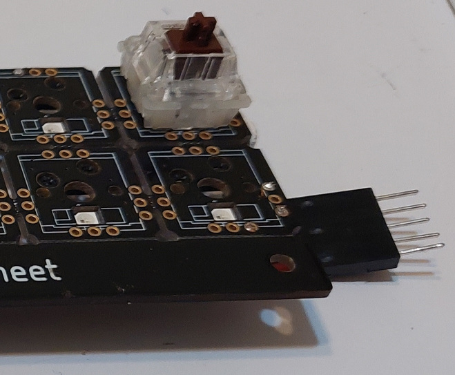

### Preparing the Enclosures for the Key Switches
It may be necessary to slightly widen the keyplate holes on the enclosures prior to attaching the key switchs and keypads.  For any give hole, try to insert a key switch without any widening.  If a switch plugs in easily, then no widening is needed.  For those holes needing widening, use a flat-sided jewler's file to slightly widen all sides of the hole.  In practice, it should not take much filing to allow a switch to plug in easily.

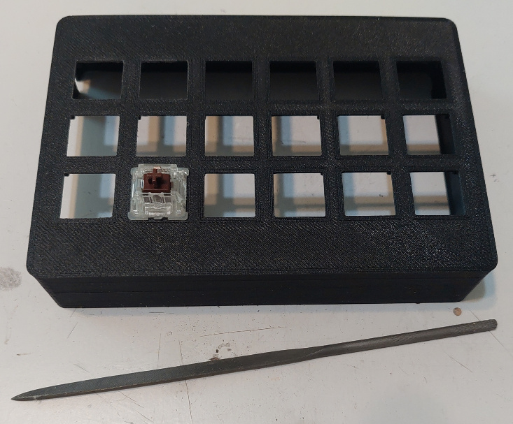

### Mounting Key Switches and Keypad PCBs to the Enclosures
**NOTE: It has been determined that the positions of the mounting holes on the keypad PCBs can be a bit variant.  If it is found that the kepads will not fit on the mounting posts, it is recommended that the posts be removed.  This results in making it a bit more difficult to initially align the keypad PCBs with the keyplate holes and key switches.**

**UPDATE: The spacing of the mounting posts on the keyboard cases have been updated to better fit the mounting holes on the keypad PCBs.  Follow the recommendation above if fitting problems still occur.**

First, slide on the keyboard bracket on to the right keyboard enclosure.  Make sure that the bracket is inserted such that the side with the tabs flush to the bracket face is inserted first.  Next, place the three-row keypad PCB into right keyboard enclosure. The female keyboard interconnect connector, the column and row cables, and the power harness should slide through the opening in the keyboard bracket. Use the mounting pins, if present, to align the key sockets with the holes of the integral key plate.

Start at one end of the enclosure and insert a key switch through the hole of the keyplate into the socket of the PCB. Place a finger against the key socket, on the bottom side of the PCB, to support key switch insertion. Having a keycap on the switch will make it easier to press the switch in.  Once the switch is inserted, go to the opposite end and insert another key switch as before.  Doing this will stablize the PCB position for inserting the rest of the key switches.  Working from the ends towards the center of the enclosure, plug in more keys until all eighteen switched are plugged in.

Now insert the left keypad PCB into the left keyboard enclosure.  As with the right keypad, align the key socket with the holes in the integral keyplate.  Insert the key switches, again working from both end of the enclosure to the center.  Once all of the key switches are inserted, slide the left keyboard enclosure onto the other side of the keyboard bracket.  While doing this, fold up the male keyboard connector to clear the bracket and then plug it into the female keyboard connector.

After completing these steps the keyboard assembly show look as shown in the picture below.

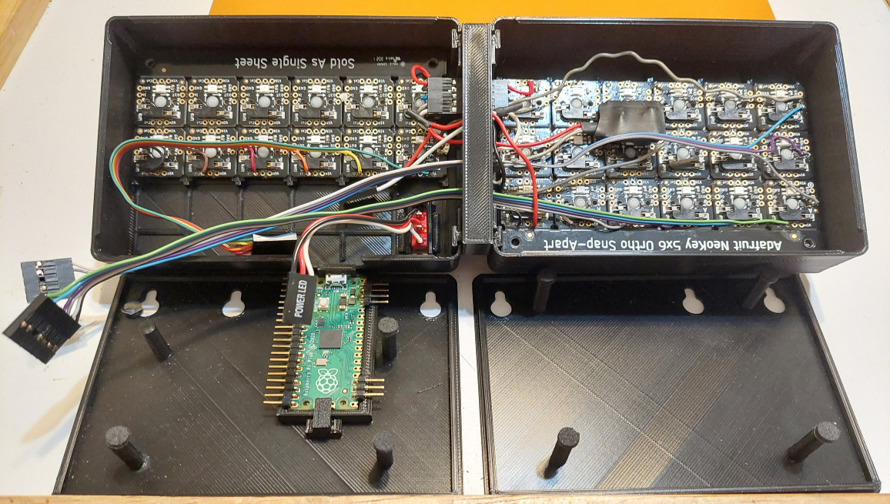

### Inserting Connectors onto the Pico
Insert the power harness connector on to pins 36 through 39 on the Pico.  Make sure that the 3.3V wire is connected to 3V3(OUT) (pin 36), the ground wire is connected to GND (pin 38), and the 5V wire is connected to VSYS (pin 39). Then, connect the column cable for the left keypad to pin 1 through pin 7 on the Pico.  The Column 0 (C0) wire should be connected to pin 1.  The picture below shows how the connections should look.

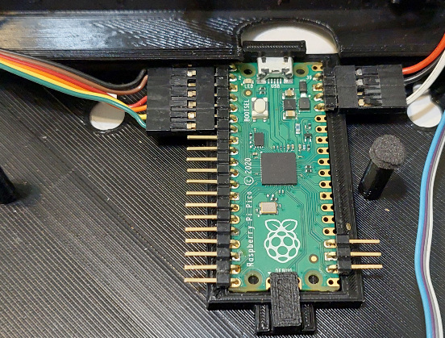

Next, insert the column cable for the right keypad to pin 9 through pin 15 on the Pico. The Column 6 (C6) wire should be connected to pin 9.  Then, connect the row cable for the right keypad to pin 16 through pin 20 on the Pico. The Row 2 (R2) wire should be connected to pin 16 and the Neopixel low voltage (NP(LV)) wire should be connected to pin 20. The picture below shows how the connections should look.  

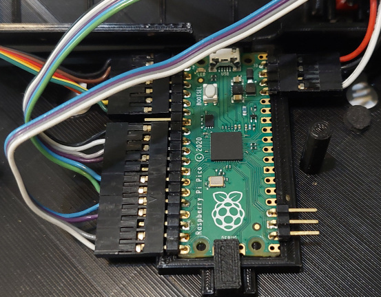

Finally, insert the connector for the Macro Mode switch onto pins 22 through 24 on the Pico.  Take note that the wires of the connector are oriented such that the slide switch grounds pin 22 when switch handle is pushed towards the center of the left keyboard enclosure and pin 24 is grounded when the switch handle is pushed towards the back edge of the left keyboard enclosure. The picture below shows how the connections should look.

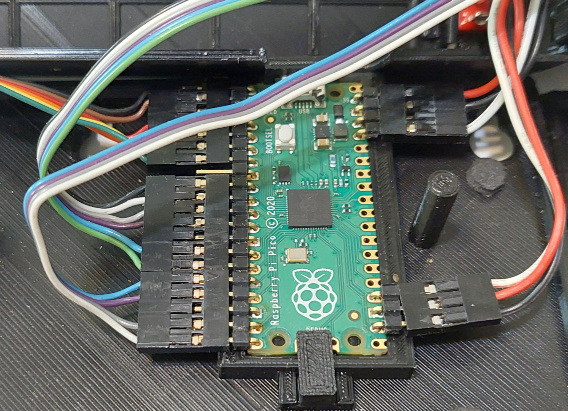

### Attach Keyboard Bases and Feet
Now that the wiring is completed, the keyboard enclosure can be closed.  Place the right keyboard base onto the bottom of the right keyboard enclosure.  Make sure that the wiring and level shifter do not interfere with the keypad PCB supports pushing up against the bottom of the right keypad.  The keyboard base is a press-fit design, so it should pop into place without too much effort.  Now, fold over the left keyboard base, making sure that the wiring does not interfere with the keypad PCB support pushing up against the bottom of the left keypad.  Snap the left keyboard base into place, as was done with the right keyboard base. The assembly should appear as shown in the picture below.

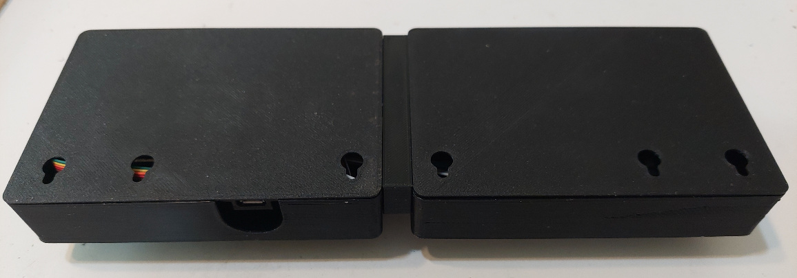

Attach the three keyboard feet by sliding the attachment pegs into the holes and sliding the feet into the slots.  **NOTE: The pegs of the keyboard feet and the holes of the base parts have been updated to a square shape.  This was done to help keep the feet from folding over after insertion.**  If desired, the right and left keyboard feet can be glued into place.  It is not recommended to glue the center foot, as doing so would make it difficult to disassemble the keyboard for maintenance or modification.

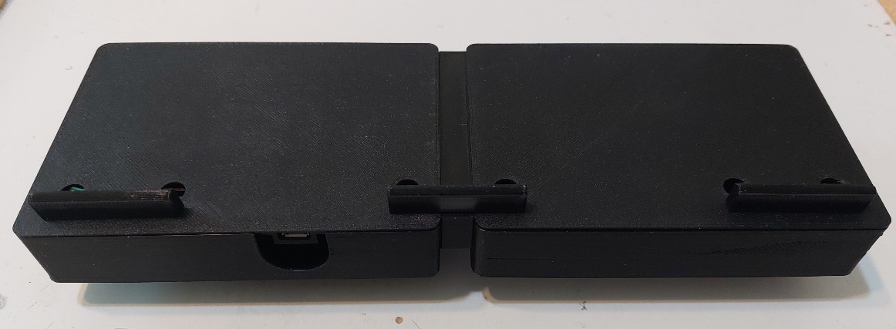

This concludes the hardware construction of the KanaChord Keyboard.  If not already done, program the Pico with the KanaChord software and put the keyboard to use!
